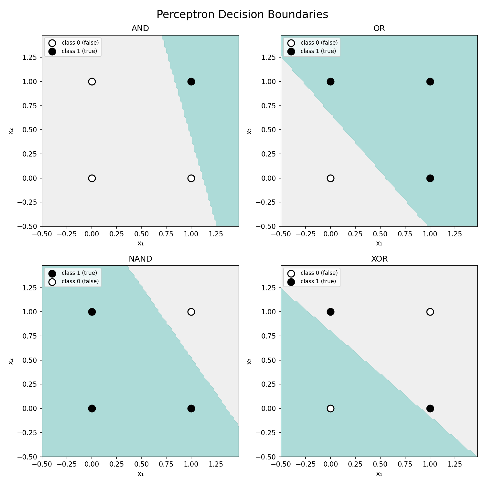

# Lesson 1: The Perceptron (Rosenblatt, 1958)

In 1958, Frank Rosenblatt at the Cornell Aeronautical Laboratory built the Mark I Perceptron — a machine that could learn to classify simple patterns. A perceptron is a single neuron that looks like this:

```
    x₁ * w₁ ──▶ o₁ ──┐
                      ├──▶ sum(o₁, o₂) + bias ──▶ step() ──▶ prediction
    x₂ * w₂ ──▶ o₂ ──┘
```

Each input (x₁, x₂) is multiplied by its weight (w₁, w₂) to produce a weighted input (o₁, o₂). The weighted inputs are summed, the bias is added, and the total is passed to a step function.

Weights are importance scores — they control how much each input matters for the decision. A large positive weight means that input pushes strongly toward "true"; a negative weight pushes toward "false."

If the weighted sum exceeds the threshold (zero, by default), the step function outputs 1 ("true"); otherwise 0 ("false"). The bias is a nudge — it shifts the threshold up or down, like setting the bar higher or lower for what counts as "true."

The learning rule follows the same spirit:

```
error  = target - prediction
wᵢ     = wᵢ + learning_rate × error × xᵢ
bias   = bias + learning_rate × error
```

When it gets the wrong answer, adjust the weights: make the ones that contributed to the mistake smaller, and the ones that would have helped bigger. The learning rate controls how big each adjustment is — too big and it overshoots, too small and it takes forever.

Here's one training step to make this concrete. Say we're learning AND with weights [0.3, -0.1] and bias 0. Input [1, 1], expected 1:

```
weighted sum = 0.3*1 + (-0.1)*1 + 0 = 0.2
step(0.2) = 1 → correct, no update needed.
```

Now input [0, 1], expected 0:

```
weighted sum = 0.3*0 + (-0.1)*1 + 0 = -0.1
step(-0.1) = 0 → correct again.
```

But input [1, 0], expected 0:

```
weighted sum = 0.3*1 + (-0.1)*0 + 0 = 0.3
step(0.3) = 1 → wrong! error = 0 - 1 = -1
new weights: [0.3 + 0.1*(-1)*1, -0.1 + 0.1*(-1)*0] = [0.2, -0.1]
new bias:    0 + 0.1*(-1) = -0.1
```

The perceptron nudged w₁ down — it learned that x₁ alone isn't enough to say "true."

Let's see what this can learn.

## Training perceptron on AND

```
Data points:
  [0.0, 0.0] → 0
  [0.0, 1.0] → 0
  [1.0, 0.0] → 0
  [1.0, 1.0] → 1

After 20 epochs (passes through all data points):
  Accuracy:    100%
  Final error: 0.0  (converged)
  Weights:     [0.179, 0.05]
  Bias:        -0.2
  Predictions:
    [0.0, 0.0] → 0 (expected 0) ✓
    [0.0, 1.0] → 0 (expected 0) ✓
    [1.0, 0.0] → 0 (expected 0) ✓
    [1.0, 1.0] → 1 (expected 1) ✓
```

```
AND
┌────────────────────────────────────────┐
│·························⣿⣿⣿⣿⣿⣿⣿⣿⣿⣿⣿⣿⣿⣿⣿│
│··························⣿⣿⣿⣿⣿⣿⣿⣿⣿⣿⣿⣿⣿⣿│
│··························⣿⣿⣿⣿⣿⣿⣿⣿⣿⣿⣿⣿⣿⣿│
│···························⣿⣿⣿⣿⣿⣿⣿⣿⣿⣿⣿⣿⣿│
│··········F················⣿⣿⣿T⣿⣿⣿⣿⣿⣿⣿⣿⣿│
│····························⣿⣿⣿⣿⣿⣿⣿⣿⣿⣿⣿⣿│
│····························⣿⣿⣿⣿⣿⣿⣿⣿⣿⣿⣿⣿│
│·····························⣿⣿⣿⣿⣿⣿⣿⣿⣿⣿⣿│
│······························⣿⣿⣿⣿⣿⣿⣿⣿⣿⣿│
│······························⣿⣿⣿⣿⣿⣿⣿⣿⣿⣿│
│·······························⣿⣿⣿⣿⣿⣿⣿⣿⣿│
│·······························⣿⣿⣿⣿⣿⣿⣿⣿⣿│
│································⣿⣿⣿⣿⣿⣿⣿⣿│
│································⣿⣿⣿⣿⣿⣿⣿⣿│
│··········F···················F··⣿⣿⣿⣿⣿⣿⣿│
│·································⣿⣿⣿⣿⣿⣿⣿│
│··································⣿⣿⣿⣿⣿⣿│
│···································⣿⣿⣿⣿⣿│
│···································⣿⣿⣿⣿⣿│
│····································⣿⣿⣿⣿│
└────────────────────────────────────────┘
```

- · predicts 0 (false)    ⣿ predicts 1 (true)
- F false (0)      T true (1)
- The line cuts off just the top-right corner
- Only when both inputs are 1 does the output land in the ⣿ region

## Training perceptron on OR

```
Data points:
  [0.0, 0.0] → 0
  [0.0, 1.0] → 1
  [1.0, 0.0] → 1
  [1.0, 1.0] → 1

After 20 epochs (passes through all data points):
  Accuracy:    100%
  Final error: 0.0  (converged)
  Weights:     [0.179, 0.15]
  Bias:        -0.1
  Predictions:
    [0.0, 0.0] → 0 (expected 0) ✓
    [0.0, 1.0] → 1 (expected 1) ✓
    [1.0, 0.0] → 1 (expected 1) ✓
    [1.0, 1.0] → 1 (expected 1) ✓
```

```
OR
┌────────────────────────────────────────┐
│⣿⣿⣿⣿⣿⣿⣿⣿⣿⣿⣿⣿⣿⣿⣿⣿⣿⣿⣿⣿⣿⣿⣿⣿⣿⣿⣿⣿⣿⣿⣿⣿⣿⣿⣿⣿⣿⣿⣿⣿│
│⣿⣿⣿⣿⣿⣿⣿⣿⣿⣿⣿⣿⣿⣿⣿⣿⣿⣿⣿⣿⣿⣿⣿⣿⣿⣿⣿⣿⣿⣿⣿⣿⣿⣿⣿⣿⣿⣿⣿⣿│
│··⣿⣿⣿⣿⣿⣿⣿⣿⣿⣿⣿⣿⣿⣿⣿⣿⣿⣿⣿⣿⣿⣿⣿⣿⣿⣿⣿⣿⣿⣿⣿⣿⣿⣿⣿⣿⣿⣿│
│···⣿⣿⣿⣿⣿⣿⣿⣿⣿⣿⣿⣿⣿⣿⣿⣿⣿⣿⣿⣿⣿⣿⣿⣿⣿⣿⣿⣿⣿⣿⣿⣿⣿⣿⣿⣿⣿│
│·····⣿⣿⣿⣿⣿T⣿⣿⣿⣿⣿⣿⣿⣿⣿⣿⣿⣿⣿⣿⣿⣿⣿⣿⣿T⣿⣿⣿⣿⣿⣿⣿⣿⣿│
│·······⣿⣿⣿⣿⣿⣿⣿⣿⣿⣿⣿⣿⣿⣿⣿⣿⣿⣿⣿⣿⣿⣿⣿⣿⣿⣿⣿⣿⣿⣿⣿⣿⣿│
│········⣿⣿⣿⣿⣿⣿⣿⣿⣿⣿⣿⣿⣿⣿⣿⣿⣿⣿⣿⣿⣿⣿⣿⣿⣿⣿⣿⣿⣿⣿⣿⣿│
│··········⣿⣿⣿⣿⣿⣿⣿⣿⣿⣿⣿⣿⣿⣿⣿⣿⣿⣿⣿⣿⣿⣿⣿⣿⣿⣿⣿⣿⣿⣿│
│············⣿⣿⣿⣿⣿⣿⣿⣿⣿⣿⣿⣿⣿⣿⣿⣿⣿⣿⣿⣿⣿⣿⣿⣿⣿⣿⣿⣿│
│·············⣿⣿⣿⣿⣿⣿⣿⣿⣿⣿⣿⣿⣿⣿⣿⣿⣿⣿⣿⣿⣿⣿⣿⣿⣿⣿⣿│
│···············⣿⣿⣿⣿⣿⣿⣿⣿⣿⣿⣿⣿⣿⣿⣿⣿⣿⣿⣿⣿⣿⣿⣿⣿⣿│
│·················⣿⣿⣿⣿⣿⣿⣿⣿⣿⣿⣿⣿⣿⣿⣿⣿⣿⣿⣿⣿⣿⣿⣿│
│··················⣿⣿⣿⣿⣿⣿⣿⣿⣿⣿⣿⣿⣿⣿⣿⣿⣿⣿⣿⣿⣿⣿│
│····················⣿⣿⣿⣿⣿⣿⣿⣿⣿⣿⣿⣿⣿⣿⣿⣿⣿⣿⣿⣿│
│··········F···········⣿⣿⣿⣿⣿⣿⣿⣿T⣿⣿⣿⣿⣿⣿⣿⣿⣿│
│·······················⣿⣿⣿⣿⣿⣿⣿⣿⣿⣿⣿⣿⣿⣿⣿⣿⣿│
│·························⣿⣿⣿⣿⣿⣿⣿⣿⣿⣿⣿⣿⣿⣿⣿│
│···························⣿⣿⣿⣿⣿⣿⣿⣿⣿⣿⣿⣿⣿│
│····························⣿⣿⣿⣿⣿⣿⣿⣿⣿⣿⣿⣿│
│······························⣿⣿⣿⣿⣿⣿⣿⣿⣿⣿│
└────────────────────────────────────────┘
```

- · predicts 0 (false)    ⣿ predicts 1 (true)
- F false (0)      T true (1)
- Weights carried over from AND — the perceptron didn't start from scratch
- The line cuts off just the bottom-left corner
- Only when both inputs are 0 does the output land in the · region

## Training perceptron on NAND

```
Data points:
  [0.0, 0.0] → 1
  [0.0, 1.0] → 1
  [1.0, 0.0] → 1
  [1.0, 1.0] → 0

After 20 epochs (passes through all data points):
  Accuracy:    100%
  Final error: 0.0  (converged)
  Weights:     [-0.221, -0.15]
  Bias:        0.3
  Predictions:
    [0.0, 0.0] → 1 (expected 1) ✓
    [0.0, 1.0] → 1 (expected 1) ✓
    [1.0, 0.0] → 1 (expected 1) ✓
    [1.0, 1.0] → 0 (expected 0) ✓
```

```
NAND
┌────────────────────────────────────────┐
│⣿⣿⣿⣿⣿⣿⣿⣿⣿⣿⣿⣿⣿⣿⣿⣿⣿⣿⣿·····················│
│⣿⣿⣿⣿⣿⣿⣿⣿⣿⣿⣿⣿⣿⣿⣿⣿⣿⣿⣿⣿····················│
│⣿⣿⣿⣿⣿⣿⣿⣿⣿⣿⣿⣿⣿⣿⣿⣿⣿⣿⣿⣿⣿···················│
│⣿⣿⣿⣿⣿⣿⣿⣿⣿⣿⣿⣿⣿⣿⣿⣿⣿⣿⣿⣿⣿⣿⣿·················│
│⣿⣿⣿⣿⣿⣿⣿⣿⣿⣿T⣿⣿⣿⣿⣿⣿⣿⣿⣿⣿⣿⣿⣿······F·········│
│⣿⣿⣿⣿⣿⣿⣿⣿⣿⣿⣿⣿⣿⣿⣿⣿⣿⣿⣿⣿⣿⣿⣿⣿⣿···············│
│⣿⣿⣿⣿⣿⣿⣿⣿⣿⣿⣿⣿⣿⣿⣿⣿⣿⣿⣿⣿⣿⣿⣿⣿⣿⣿⣿·············│
│⣿⣿⣿⣿⣿⣿⣿⣿⣿⣿⣿⣿⣿⣿⣿⣿⣿⣿⣿⣿⣿⣿⣿⣿⣿⣿⣿⣿············│
│⣿⣿⣿⣿⣿⣿⣿⣿⣿⣿⣿⣿⣿⣿⣿⣿⣿⣿⣿⣿⣿⣿⣿⣿⣿⣿⣿⣿⣿···········│
│⣿⣿⣿⣿⣿⣿⣿⣿⣿⣿⣿⣿⣿⣿⣿⣿⣿⣿⣿⣿⣿⣿⣿⣿⣿⣿⣿⣿⣿⣿⣿·········│
│⣿⣿⣿⣿⣿⣿⣿⣿⣿⣿⣿⣿⣿⣿⣿⣿⣿⣿⣿⣿⣿⣿⣿⣿⣿⣿⣿⣿⣿⣿⣿⣿········│
│⣿⣿⣿⣿⣿⣿⣿⣿⣿⣿⣿⣿⣿⣿⣿⣿⣿⣿⣿⣿⣿⣿⣿⣿⣿⣿⣿⣿⣿⣿⣿⣿⣿⣿······│
│⣿⣿⣿⣿⣿⣿⣿⣿⣿⣿⣿⣿⣿⣿⣿⣿⣿⣿⣿⣿⣿⣿⣿⣿⣿⣿⣿⣿⣿⣿⣿⣿⣿⣿⣿·····│
│⣿⣿⣿⣿⣿⣿⣿⣿⣿⣿⣿⣿⣿⣿⣿⣿⣿⣿⣿⣿⣿⣿⣿⣿⣿⣿⣿⣿⣿⣿⣿⣿⣿⣿⣿⣿····│
│⣿⣿⣿⣿⣿⣿⣿⣿⣿⣿T⣿⣿⣿⣿⣿⣿⣿⣿⣿⣿⣿⣿⣿⣿⣿⣿⣿⣿⣿T⣿⣿⣿⣿⣿⣿⣿··│
│⣿⣿⣿⣿⣿⣿⣿⣿⣿⣿⣿⣿⣿⣿⣿⣿⣿⣿⣿⣿⣿⣿⣿⣿⣿⣿⣿⣿⣿⣿⣿⣿⣿⣿⣿⣿⣿⣿⣿·│
│⣿⣿⣿⣿⣿⣿⣿⣿⣿⣿⣿⣿⣿⣿⣿⣿⣿⣿⣿⣿⣿⣿⣿⣿⣿⣿⣿⣿⣿⣿⣿⣿⣿⣿⣿⣿⣿⣿⣿⣿│
│⣿⣿⣿⣿⣿⣿⣿⣿⣿⣿⣿⣿⣿⣿⣿⣿⣿⣿⣿⣿⣿⣿⣿⣿⣿⣿⣿⣿⣿⣿⣿⣿⣿⣿⣿⣿⣿⣿⣿⣿│
│⣿⣿⣿⣿⣿⣿⣿⣿⣿⣿⣿⣿⣿⣿⣿⣿⣿⣿⣿⣿⣿⣿⣿⣿⣿⣿⣿⣿⣿⣿⣿⣿⣿⣿⣿⣿⣿⣿⣿⣿│
│⣿⣿⣿⣿⣿⣿⣿⣿⣿⣿⣿⣿⣿⣿⣿⣿⣿⣿⣿⣿⣿⣿⣿⣿⣿⣿⣿⣿⣿⣿⣿⣿⣿⣿⣿⣿⣿⣿⣿⣿│
└────────────────────────────────────────┘
```

- · predicts 0 (false)    ⣿ predicts 1 (true)
- F false (0)      T true (1)
- Weights carried over from OR — the perceptron had to unlearn OR to learn NAND
- This is AND's mirror image — the ⣿ and · regions are flipped
- NAND is just AND with the decision reversed

## Training perceptron on XOR

```
Data points:
  [0.0, 0.0] → 0
  [0.0, 1.0] → 1
  [1.0, 0.0] → 1
  [1.0, 1.0] → 0

After 20 epochs (passes through all data points):
  Accuracy:    25%
  Final error: 4.0  (did not converge)
  Weights:     [-0.221, -0.25]
  Bias:        0.2
  Predictions:
    [0.0, 0.0] → 1 (expected 0) ✗
    [0.0, 1.0] → 0 (expected 1) ✗
    [1.0, 0.0] → 0 (expected 1) ✗
    [1.0, 1.0] → 0 (expected 0) ✓
```

```
XOR
┌────────────────────────────────────────┐
│········································│
│········································│
│⣿·······································│
│⣿⣿⣿⣿····································│
│⣿⣿⣿⣿⣿⣿····T···················F·········│
│⣿⣿⣿⣿⣿⣿⣿⣿································│
│⣿⣿⣿⣿⣿⣿⣿⣿⣿⣿⣿·····························│
│⣿⣿⣿⣿⣿⣿⣿⣿⣿⣿⣿⣿⣿···························│
│⣿⣿⣿⣿⣿⣿⣿⣿⣿⣿⣿⣿⣿⣿⣿·························│
│⣿⣿⣿⣿⣿⣿⣿⣿⣿⣿⣿⣿⣿⣿⣿⣿⣿·······················│
│⣿⣿⣿⣿⣿⣿⣿⣿⣿⣿⣿⣿⣿⣿⣿⣿⣿⣿⣿⣿····················│
│⣿⣿⣿⣿⣿⣿⣿⣿⣿⣿⣿⣿⣿⣿⣿⣿⣿⣿⣿⣿⣿⣿··················│
│⣿⣿⣿⣿⣿⣿⣿⣿⣿⣿⣿⣿⣿⣿⣿⣿⣿⣿⣿⣿⣿⣿⣿⣿················│
│⣿⣿⣿⣿⣿⣿⣿⣿⣿⣿⣿⣿⣿⣿⣿⣿⣿⣿⣿⣿⣿⣿⣿⣿⣿⣿··············│
│⣿⣿⣿⣿⣿⣿⣿⣿⣿⣿F⣿⣿⣿⣿⣿⣿⣿⣿⣿⣿⣿⣿⣿⣿⣿⣿⣿⣿·T·········│
│⣿⣿⣿⣿⣿⣿⣿⣿⣿⣿⣿⣿⣿⣿⣿⣿⣿⣿⣿⣿⣿⣿⣿⣿⣿⣿⣿⣿⣿⣿⣿·········│
│⣿⣿⣿⣿⣿⣿⣿⣿⣿⣿⣿⣿⣿⣿⣿⣿⣿⣿⣿⣿⣿⣿⣿⣿⣿⣿⣿⣿⣿⣿⣿⣿⣿·······│
│⣿⣿⣿⣿⣿⣿⣿⣿⣿⣿⣿⣿⣿⣿⣿⣿⣿⣿⣿⣿⣿⣿⣿⣿⣿⣿⣿⣿⣿⣿⣿⣿⣿⣿⣿·····│
│⣿⣿⣿⣿⣿⣿⣿⣿⣿⣿⣿⣿⣿⣿⣿⣿⣿⣿⣿⣿⣿⣿⣿⣿⣿⣿⣿⣿⣿⣿⣿⣿⣿⣿⣿⣿⣿⣿··│
│⣿⣿⣿⣿⣿⣿⣿⣿⣿⣿⣿⣿⣿⣿⣿⣿⣿⣿⣿⣿⣿⣿⣿⣿⣿⣿⣿⣿⣿⣿⣿⣿⣿⣿⣿⣿⣿⣿⣿⣿│
└────────────────────────────────────────┘
```

- · predicts 0 (false)    ⣿ predicts 1 (true)
- F false (0)      T true (1)
- T/F misclassified
- T and F points are on the same side of the line
- No single straight line can separate (0,0)/(1,1) from (0,1)/(1,0)
- This is what 'not linearly separable' looks like

## Why XOR Fails

The perceptron draws a single straight line to separate classes. AND, OR, and NAND are all linearly separable — you can draw a line with class 0 on one side and class 1 on the other.

XOR is different. The points (0,0) and (1,1) are class 0, while (0,1) and (1,0) are class 1. No single line can separate them. Training longer doesn't help — even after 1000 epochs, XOR stays at 25% accuracy. The problem isn't patience, it's architecture.

This limitation was famously highlighted by Minsky & Papert in 1969, contributing to the first "AI winter." The solution — multiple layers of neurons (the MLP) — would come later, which we'll see in Lesson 2.

## Plots

### Decision Boundaries

All four logic gates plotted together — AND, OR, NAND, and XOR. The first three show clean linear separations: a single straight line divides the true and false regions. XOR's plot shows the failure: both classes end up on the same side of the line, no matter where the perceptron draws it. This is the visual proof that a single neuron can't solve problems that aren't linearly separable.


