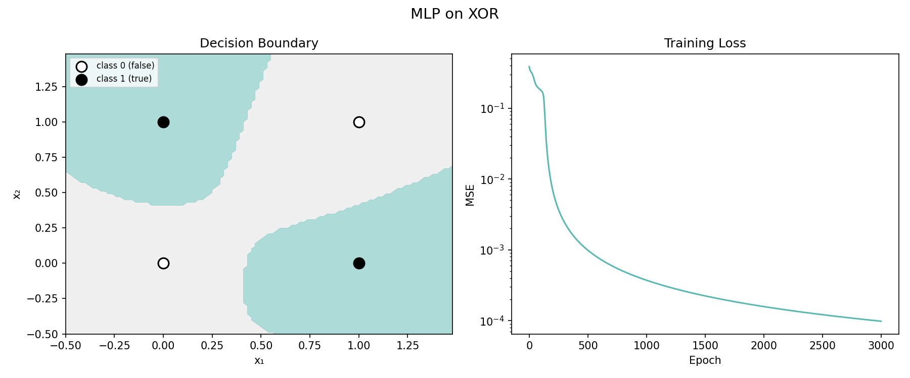
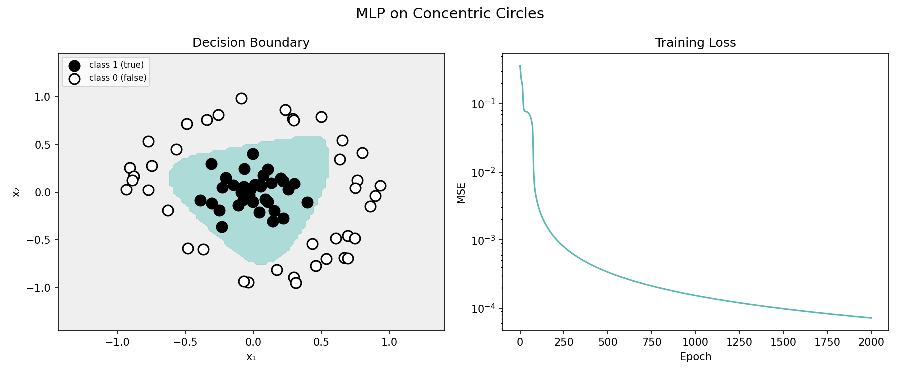

# Lesson 2: Backpropagation and the MLP (Rumelhart, Hinton & Williams, 1986)

In Lesson 1 we saw the perceptron fail on XOR showing a fundamental limit. Minsky and Papert proved in 1969 that a single-layer perceptron cannot learn any function that isn't linearly separable. Their book "Perceptrons" was so influential that research funding for neural networks largely dried up.

The field went quiet for over a decade. Other approaches to AI— expert systems, symbolic reasoning—took center stage. Neural networks were considered a dead end.

Then in 1986, Rumelhart, Hinton, and Williams published "Learning representations by back-propagating errors." The key ideas:

1. Add hidden layers between input and output. These layers learn intermediate representations, transforming the input into a space where the problem becomes linearly separable.

2. Use smooth activation functions (sigmoid instead of step). The step function is flat everywhere except at the threshold, so there's no gradient to follow. Sigmoid is smooth — you can ask "if I nudge this weight, how much does the output change?"

3. Apply the chain rule layer by layer (backpropagation). Start from the loss, work backwards through each layer, and compute how much each weight contributed to the error. Then adjust every weight simultaneously.

The chain rule is simple: if A affects B and B affects the loss, multiply the two effects to find how A affects the loss. That's it. Backpropagation just applies this rule repeatedly, layer by layer:

```
Forward:   a₀ → [W₁] → z₁ → [σ] → a₁ → [W₂] → z₂ → [σ] → a₂ → L
Backward:  dL/da₂ → dL/dz₂ → dL/dW₂, dL/da₁ → dL/dz₁ → dL/dW₁
```

For each layer:

```
δ = dL/da ⊙ σ'(z)        (⊙ = element-wise multiply: scale each neuron's blame by its slope)
dL/dW = outer(δ, input)   (outer product: multiply every pair to get a matrix of weight gradients)
dL/da_prev = Wᵀ @ δ       (pass the blame backwards)
```

Let's trace this concretely through our 2-hidden-neuron XOR network. Same variables as the forward pass: w₁₁, w₂₁, w₁₂, w₂₂, v₁, v₂, b₁, b₂, b₃, h₁, h₂, y.

Start at the loss. We used MSE — Mean Squared Error — which measures how far off a prediction is by squaring the difference: MSE = (y - target)². Squaring means bigger mistakes are penalized more than small ones. Its derivative with respect to y is 2 * (y - target):

```
dL/dy = 2 * (y - target)
```

This is "how far off was y?" If y = 0.8 and target = 1, the gradient is -0.4 — the output was too low.

Step 1: Output layer δ. Multiply the loss gradient by the slope of sigmoid at the output neuron's pre-activation:

```
δ₃ = dL/dy * σ'(z₃)
```

σ'(z) is largest at z = 0 (where sigmoid is steepest) and shrinks toward 0 at extremes. So neurons that are very confident (near 0 or 1) get small updates — they're already saturated. This is the "vanishing gradient" problem: in deeper networks, these tiny slopes multiply together and gradients can shrink to near zero. We'll return to this in later lessons.

Step 2: Output weight gradients. How much did v₁ and v₂ contribute? Each hidden neuron's output was multiplied by its weight, so:

```
dL/dv₁ = δ₃ * h₁
dL/dv₂ = δ₃ * h₂
dL/db₃ = δ₃
```

If h₁ was large, v₁ gets more blame. If h₁ was near zero, v₁ barely mattered.

Step 3: Pass blame to the hidden layer. Each hidden neuron contributed to the error through its output weight:

```
dL/dh₁ = v₁ * δ₃
dL/dh₂ = v₂ * δ₃
```

This is the chain rule at work: v₁ tells us how much h₁ influenced the output, and δ₃ tells us how much the output influenced the loss.

Step 4: Hidden layer δ. Same pattern as Step 1 — we scale the blame by how responsive the neuron was (its sigmoid slope):

```
δ₁ = dL/dh₁ * σ'(z₁)
δ₂ = dL/dh₂ * σ'(z₂)
```

Step 5: Input weight gradients. Now we can blame the original weights:

```
dL/dw₁₁ = δ₁ * x₁       dL/dw₁₂ = δ₂ * x₁
dL/dw₂₁ = δ₁ * x₂       dL/dw₂₂ = δ₂ * x₂
dL/db₁  = δ₁             dL/db₂  = δ₂
```

Every weight gets told exactly how much it contributed to the error, no matter how deep in the network.

This is what makes deep learning possible: every layer gets a gradient, every weight gets an update, all from one forward pass and one backward pass.

Let's see it solve XOR.

## Part 1: Solving XOR

The perceptron failed on XOR because no single line can separate (0,0)/(1,1) from (0,1)/(1,0). An MLP adds a hidden layer between input and output. Here's a network with two hidden neurons:

```
     Input            Hidden         Output

     x₁  o ─ w₁₁ ─┐
                  ├─► o h₁ ─ v₁  ─┐
     x₂  o ─ w₂₁ ─┘    + b₁       │
                                  ├─► o y
     x₁  o ─ w₁₂ ─┐               │    + b₃
                  ├─► o h₂ ─ v₂  ─┘
     x₂  o ─ w₂₂ ─┘    + b₂
```

Each hidden neuron receives both inputs through its own weights, adds a bias, and passes the result through sigmoid (written σ). The output neuron combines the hidden outputs the same way.

For the input → hidden connections:

- w₁₁: weight from input x₁ → hidden neuron h₁
- w₂₁: weight from input x₂ → hidden neuron h₁
- w₁₂: weight from input x₁ → hidden neuron h₂
- w₂₂: weight from input x₂ → hidden neuron h₂

You can read the indices as:

```
w₁₁ = weight from input 1 → hidden neuron 1
```

So the hidden neurons compute weighted sums like:

```
h₁ = σ(w₁₁ * x₁ + w₂₁ * x₂ + b₁)
h₂ = σ(w₁₂ * x₁ + w₂₂ * x₂ + b₂)
```

Then the hidden layer connects to the output using another set of weights:

- v₁: weight from h₁ → y
- v₂: weight from h₂ → y

So the output computes:

```
y = σ(v₁ * h₁ + v₂ * h₂ + b₃)
```

The key idea is that every arrow in the diagram gets its own weight.

In theory two hidden neurons suffice for XOR, but in practice a few more gives gradient descent an easier landscape to navigate. We'll use four. The hidden neurons learn features like "at least one input is on" and "both inputs are on." The output neuron combines them: "at least one, but not both."

Our diagram shows a 2-2-1 network (9 weights) and we'll train a 2-4-1 (17 weights). Real networks in the late 1980s were bigger but still modest by modern standards. Typical MLPs had one or two hidden layers with tens to a few hundred neurons — maybe 10,000 to 100,000 weights total. NETtalk (1987), which learned to pronounce English text, used a 203-80-26 architecture with about 18,000 weights. These networks ran on workstations and could take hours or days to train.

```
Data points (same as lesson 1):
  [0.0, 0.0] → 0
  [0.0, 1.0] → 1
  [1.0, 0.0] → 1
  [1.0, 1.0] → 0

Before training (random weights):
  [0.0, 0.0] → 0.288  (expected 0)
  [0.0, 1.0] → 0.314  (expected 1)
  [1.0, 0.0] → 0.295  (expected 1)
  [1.0, 1.0] → 0.319  (expected 0)

Training: lr=2.0, epochs=3000

After training:
  Final loss: 0.000098
  [0.0, 0.0] → 0.006 → 0  (expected 0) ✓
  [0.0, 1.0] → 0.991 → 1  (expected 1) ✓
  [1.0, 0.0] → 0.991 → 1  (expected 1) ✓
  [1.0, 1.0] → 0.014 → 0  (expected 0) ✓

Solved!
```

What the hidden layer sees: The hidden layer transforms each input into a new representation. In this new space, XOR becomes linearly separable:

```
[0.0, 0.0] → [0.919, 0.898, 0.290, 0.136]  (class 0)
[0.0, 1.0] → [0.819, 0.012, 0.883, 0.000]  (class 1)
[1.0, 0.0] → [0.226, 0.018, 0.001, 0.936]  (class 1)
[1.0, 1.0] → [0.104, 0.000, 0.023, 0.014]  (class 0)
```

Notice that same-class points cluster to similar activation patterns, while different classes separate — the hidden layer has untangled them.

```
XOR (MLP)
┌────────────────────────────────────────┐
│⣿⣿⣿⣿⣿⣿⣿⣿⣿⣿⣿⣿⣿⣿⣿⣿⣿⣿⣿⣿⣿···················│
│⣿⣿⣿⣿⣿⣿⣿⣿⣿⣿⣿⣿⣿⣿⣿⣿⣿⣿⣿⣿⣿···················│
│⣿⣿⣿⣿⣿⣿⣿⣿⣿⣿⣿⣿⣿⣿⣿⣿⣿⣿⣿⣿····················│
│⣿⣿⣿⣿⣿⣿⣿⣿⣿⣿⣿⣿⣿⣿⣿⣿⣿⣿⣿·····················│
│⣿⣿⣿⣿⣿⣿⣿⣿⣿⣿T⣿⣿⣿⣿⣿⣿⣿⣿···········F·········│
│⣿⣿⣿⣿⣿⣿⣿⣿⣿⣿⣿⣿⣿⣿⣿⣿⣿⣿······················│
│⣿⣿⣿⣿⣿⣿⣿⣿⣿⣿⣿⣿⣿⣿⣿⣿⣿⣿······················│
│⣿⣿⣿⣿⣿⣿⣿⣿⣿⣿⣿⣿⣿⣿⣿⣿⣿·······················│
│··⣿⣿⣿⣿⣿⣿⣿⣿⣿⣿⣿⣿⣿⣿·····················⣿⣿⣿│
│·····⣿⣿⣿⣿⣿⣿⣿⣿⣿⣿···················⣿⣿⣿⣿⣿⣿│
│······························⣿⣿⣿⣿⣿⣿⣿⣿⣿⣿│
│·························⣿⣿⣿⣿⣿⣿⣿⣿⣿⣿⣿⣿⣿⣿⣿│
│·····················⣿⣿⣿⣿⣿⣿⣿⣿⣿⣿⣿⣿⣿⣿⣿⣿⣿⣿⣿│
│····················⣿⣿⣿⣿⣿⣿⣿⣿⣿⣿⣿⣿⣿⣿⣿⣿⣿⣿⣿⣿│
│··········F········⣿⣿⣿⣿⣿⣿⣿⣿⣿⣿⣿T⣿⣿⣿⣿⣿⣿⣿⣿⣿│
│···················⣿⣿⣿⣿⣿⣿⣿⣿⣿⣿⣿⣿⣿⣿⣿⣿⣿⣿⣿⣿⣿│
│···················⣿⣿⣿⣿⣿⣿⣿⣿⣿⣿⣿⣿⣿⣿⣿⣿⣿⣿⣿⣿⣿│
│···················⣿⣿⣿⣿⣿⣿⣿⣿⣿⣿⣿⣿⣿⣿⣿⣿⣿⣿⣿⣿⣿│
│····················⣿⣿⣿⣿⣿⣿⣿⣿⣿⣿⣿⣿⣿⣿⣿⣿⣿⣿⣿⣿│
│······················⣿⣿⣿⣿⣿⣿⣿⣿⣿⣿⣿⣿⣿⣿⣿⣿⣿⣿│
└────────────────────────────────────────┘
```

- · predicts 0 (false)    ⣿ predicts 1 (true)
- F false (0)      T true (1)

```
Learned weights:
  hidden: W=[[-3.661, -0.922], [-6.15, -6.628], [-5.787, 2.91], [4.533, -6.919]], b=[2.43, 2.175, -0.893, -1.853]
  output: W=[[4.577, -8.428, 6.888, 9.427]], b=[-5.044]
```

## Part 2: Concentric Circles

XOR has only 4 points. Let's try something harder: two concentric circles. Points near the center are class 1, points on the outer ring are class 0. No straight line can separate inside from outside, you need a curved boundary, which is what the hidden layer learns.

```
Data: 80 points (40 inner, 40 outer)
Training: lr=1.0, epochs=2000

Final loss: 0.000072
Accuracy:   100%
```

```
Circles (MLP)
┌────────────────────────────────────────┐
│········································│
│········································│
│···················F····················│
│·······················F················│
│·············F·FF·······F··F············│
│·········F···················F··········│
│············F·····⣿⣿T⣿⣿⣿⣿⣿⣿⣿···F········│
│·······F··F··⣿⣿⣿T⣿⣿T⣿T⣿⣿⣿⣿⣿⣿·F··········│
│········F···⣿⣿⣿⣿⣿T⣿⣿⣿TTT⣿⣿⣿⣿···F········│
│·······F·F··⣿⣿⣿⣿⣿TTTTT⣿⣿T⣿⣿⣿··F··F······│
│···········F·⣿⣿TTTTTTTT⣿⣿⣿T·····F·······│
│···············⣿⣿⣿⣿⣿⣿TTT⣿⣿··············│
│················⣿T⣿⣿⣿⣿⣿⣿⣿···F·F·········│
│·············F·F··⣿⣿⣿⣿⣿⣿··F·············│
│····················⣿⣿⣿···F·FFF·········│
│······················F·F···············│
│···················F····F···············│
│········································│
│········································│
│········································│
└────────────────────────────────────────┘
```

- · predicts 0 (false)    ⣿ predicts 1 (true)
- F false (0)      T true (1)

## What Changed

The perceptron had one neuron and one straight line. The MLP has layers and curves. But the real breakthrough isn't the architecture — it's the learning algorithm.

The perceptron learning rule was direct: if wrong, nudge the weights. But it only works for one layer. There's no way to tell a hidden neuron "you contributed to the mistake". The error signal stops at the output.

Backpropagation solves this. By applying the chain rule layer by layer, it assigns credit (or blame) to every weight in the network. A weight deep in the first hidden layer gets a gradient that says "here's how much you contributed to the final error, through every layer between you and the output."

The 1986 paper didn't invent backpropagation (the idea appeared independently several times in the 1960s-70s), but it demonstrated convincingly that it worked. Networks with hidden layers can learn useful internal representations. This revived the field and set the stage for everything that followed.

But notice the cost. The perceptron updated each weight with a single multiply. Backpropagation requires a full forward pass, then a full backward pass, computing and storing intermediate values at every layer. Our 17-weight XOR network trains in milliseconds. NETtalk's 18,000 weights took hours on a 1987 workstation. This pattern — more capacity means more compute — will intensify with every lesson that follows.

Next up: convolutional networks (Lesson 3), where we'll see how to exploit the structure of images instead of treating every pixel as an independent input.

## End of Lesson 2

## Plots

### XOR Decision Boundary

The MLP carves a curved boundary through the input space, isolating the two "true" corners (top-left, bottom-right) from the two "false" corners. Compare this to the perceptron's single straight line in Lesson 1 — the hidden layer learned to warp the space so that XOR becomes separable.



### Concentric Circles Decision Boundary

A harder test: 80 points arranged in two concentric rings. The MLP learns a closed, roughly circular boundary separating the inner class from the outer class. No single line (or even two lines) could do this — the hidden layer transforms the radial distance into a feature the output neuron can threshold.


