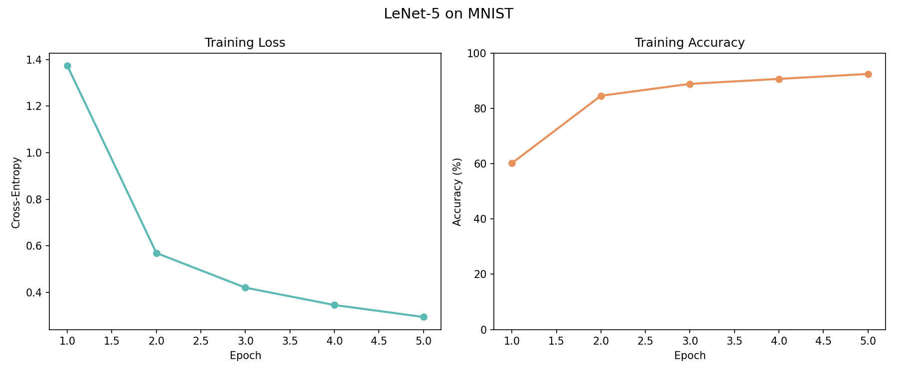

# Lesson 3: LeNet-5 / Convolutional Neural Networks (LeCun et al., 1998)

In Lesson 2 we trained an MLP on XOR and concentric circles — problems with a handful of inputs. But what about images?

A 28x28 grayscale image has 784 pixels. An MLP treating each pixel as an independent input needs a weight for every connection between every pixel and every hidden neuron. For a 784-input, 120-hidden MLP, that's 94,080 weights in just the first layer, and it learns nothing about spatial structure. That means a '3' in the top-left corner looks like a completely different input to a '3' in the center, even though they're the same digit.

In the late 1980s and 1990s, Yann LeCun at Bell Labs was working on a practical problem: the US Postal Service needed to automatically read handwritten zip codes on envelopes. Processing millions of letters a day, human sorting was expensive and slow.

LeCun's insight was that images have structure that a clever architecture can exploit:

1. **Locality:** nearby pixels matter more than distant ones. A small 5x5 window captures edges and curves.

2. **Translation invariance:** a '3' is a '3' wherever it appears. The same small filter (called a 'kernel') can slide across the entire image, looking for the same pattern everywhere.

3. **Hierarchy:** simple features combine into complex ones. Edges become curves, curves become loops, loops become digits.

These ideas led to the convolutional neural network (CNN):

```
     Input         C1            S2          C3          S4        Dense
    1x28x28    3x24x24       3x12x12     6x8x8       6x4x4      96->32->10

    ┌─────┐    ┌─────┐       ┌───┐       ┌───┐       ┌──┐
    │     │    │ ┌─┐ │       │   │       │   │       │  │       ┌──┐  ┌──┐
    │image│─5x5│ │f│ │─pool──│   │─5x5───│   │─pool──│  │─flat──│32│──│10│
    │     │    │ └─┘ │       │   │       │   │       │  │       └──┘  └──┘
    └─────┘    └─────┘       └───┘       └───┘       └──┘
               3 filters     avg 2x2    6 filters    avg 2x2   tanh  softmax
```

Reading left to right:

- **Input (1x28x28):** a single grayscale image. The "1" is the channel count: grayscale has one channel, color (RGB) would have three. Each pixel is a float from 0 (black) to 1 (white).

- **C1: Convolution (3x24x24)** — three 5x5 filters slide across the image. Each filter is a tiny 5x5 grid of learnable weights. At each position, it computes a dot product with the 25 pixels underneath, producing one output value. A 28x28 image with a 5x5 filter yields a 24x24 output (28-5+1=24). Three filters produce three such maps, each detecting a different pattern — one might respond to horizontal edges, another to vertical ones, a third to corners. This is weight sharing: the same 25 weights check every position.

- **S2: Pooling (3x12x12):** each 2x2 block is replaced by its average, halving the spatial dimensions. This makes the representation robust to small shifts — a feature detected at pixel (10,10) and one at (11,11) both end up in the same pooled cell.

- **C3: Convolution (6x8x8):** six 5x5 filters, but now each filter reads all three channels from S2. So each filter has 3x5x5=75 weights, combining features across the previous layer's maps. The first layer found edges; this layer finds combinations of edges — curves, corners, junctions.

- **S4: Pooling (6x4x4):** another 2x2 average pool. The spatial dimensions shrink further, but the feature count grows. We started with 1 channel of raw pixels and now have 6 channels of abstract features.

- **Flatten (96):** reshape the 6x4x4 volume into a flat vector. This is the bridge from spatial processing to classification: the conv layers extracted features, now the dense layers decide what digit they represent.

- **Dense (32 then 10):** standard fully-connected layers, just like the MLP from Lesson 2. The first uses tanh activation, the second uses softmax to produce probabilities for each of the 10 digits.

Our simplified LeNet has 3+6 filters (the original used 6+16) and 32 dense neurons (the original used 120+84). Fewer parameters means faster training in pure Python while preserving the architecture's structure.

Let's see it learn to read handwriting.

## Part 1: The Data

Loading MNIST dataset (this takes a few seconds)...

```
Training set: 1000 images
Test set:     200 images
Image shape:  1x28x28
Digit distribution: [94, 107, 89, 105, 115, 93, 96, 103, 94, 104]
```

Sample digits from the dataset:

Label: 2
```
····························
····························
···········████▒············
·········▒██████▒···········
·········█████▒██···········
··········▒···▒██░··········
··············▒███··········
··············▒██▒··········
···········▒█████░··········
·········░███▒█████▒········
··········██▒▒██▒▒██░·······
··········▒█████···░········
····························
····························
```

Label: 3
```
····························
····························
···············░▒██▒········
···············▒███▒········
·········░▒█▒████░··········
·······█████░░▒▒············
·········░░░░····███▒·······
···················▒██······
···················███······
······▒█········░███▒·······
·····▒██▒░▒▒██████▒·········
······░▒▒▒▒█▒▒░·············
····························
····························
```

Label: 7
```
····························
····························
····························
····························
······▒████████████·········
······░▒░░░░▒███████········
················▒███········
················████········
···············████▒········
··············████░·········
·············████···········
············████············
············███▒············
············▒█░·············
```

## Part 2: Training

```
Model architecture:
  C1: conv 5x5, 1->3 filters       78 params
  S2: avg pool 2x2                   0 params
  C3: conv 5x5, 3->6 filters      456 params
  S4: avg pool 2x2                   0 params
  F5: dense 96->32                3104 params
  F6: dense 32->10                 330 params
  Total:                          3968 params
```

Compare: a fully-connected MLP with 784->120->84->10 would need 784*120 + 120*84 + 84*10 = 105,000+ params. The CNN achieves more with 3968: weight sharing works.

```
Training: lr=0.01, epochs=5, samples=1000
(This takes a few minutes in pure Python, watch the progress bar)

Training: epoch 5/5  loss=0.2943  [██████████████████████████████] 100%

Training results:
  Epoch 1: loss=1.3733  accuracy=60%
  Epoch 2: loss=0.5691  accuracy=85%
  Epoch 3: loss=0.4202  accuracy=89%
  Epoch 4: loss=0.3456  accuracy=91%
  Epoch 5: loss=0.2943  accuracy=92%
```

## Part 3: Evaluation

Test accuracy: 175/200 = 88%

Sample predictions:

Predicted: 5 (correct)
```
····························
····························
···············▒██████▒·····
··············░·············
············░███▒···········
··········░████·············
·········█████████··········
················░███········
················███·········
·····▒░·······▒███··········
·····▒█░·░░▒█████░··········
······▒█████▒░··············
····························
····························
```

Predicted: 2 (correct)
```
····························
····························
·········███▒▒▒·············
··········█░░▒█████░········
··················██▒·······
··················▒█▒·······
··················▒█▒·······
··················██░·······
········░█████▒··██▒········
·······░██···░████▒·········
·······▒█▒····▒██▒██········
········▒██████░············
····························
····························
```

Predicted: 8 (correct)
```
····························
····························
····························
··········▒▒████░···········
·······▒████████████░·······
·····░████·······████▒······
······▒████▒·······██▒······
········░▒█████▒·▒██▒·······
·············░█████·········
·············▒█████░········
···········▒███·░██▒········
···········██▒·▒███░········
···········██████░··········
····························
```

Predicted: 8 (WRONG (expected 2))
```
····························
····························
·············▒███░··········
···········░██▒·▒██·········
··········░██····░██········
·········░██·······██·······
·········▒█░·······▒█▒······
··········▒··▒▒····██░······
··········▒██████░███·······
·········██▒···░███·········
········██▒·░██████░········
········█████▒···▒█▒········
····························
····························
```

Predicted: 3 (correct)
```
····························
····························
····························
·····███████████▒▒█▒········
······░▒██████████▒·········
············░██░············
···········▒██··············
···········░██··············
············██░·············
···············▒████░·······
···················░██░·····
····················░██·····
···········██████████▒░·····
····························
```

Predicted: 2 (correct)
```
····························
····························
··········░▒███░············
········░▒███████▒··········
·······░██▒░··░███··········
·······░░░·····███··········
···············███░·········
··············░███··········
············▒▒███···········
··········███████▒░·········
········▒████████████·······
········▒██▒·····░███▒······
····························
····························
```

## What Changed

The MLP treated every pixel as an independent input. The CNN treats the image as a 2D grid and exploits its spatial structure.

The key innovations:

- **Weight sharing:** one 5x5 filter with 25 weights checks every position in the image. An MLP would need separate weights for every pixel-to-neuron connection.

- **Feature hierarchy:** the first conv layer learns edges and simple textures. The second conv layer combines those into curves, corners, and strokes. The dense layers combine those into digit classifications.

- **Pooling:** averaging 2x2 blocks makes the representation robust to small translations. A "7" shifted one pixel right still activates the same pooled features.

LeCun's LeNet-5 was deployed in real systems: ATMs that read checks, postal machines that sorted mail by zip code. By the late 1990s, it was reading 10-20% of all checks deposited in US banks.

But again notice the cost. Our simplified LeNet with 3968 parameters takes minutes to train on 1000 images in pure Python. The original LeNet-5 had ~60,000 parameters and trained on 60,000 images. Modern CNNs like ResNet have millions of parameters and train on millions of images using GPUs. It's the same algorithm, but with vastly more compute.

Next up: the Transformer (Lesson 4), where we replace spatial structure with attention, learning which parts of the input matter for each part of the output.

## Plots

### Training Loss Curve

Loss drops steeply in the first epoch (from random guessing to basic digit recognition), then gradually improves over the remaining epochs. The curve shows the characteristic shape of SGD training: fast initial progress as the network learns broad features (edges, strokes), then slower refinement as it fine-tunes digit-specific patterns. Final accuracy reaches ~90% on the test set with just 3,968 parameters and 5 epochs.


