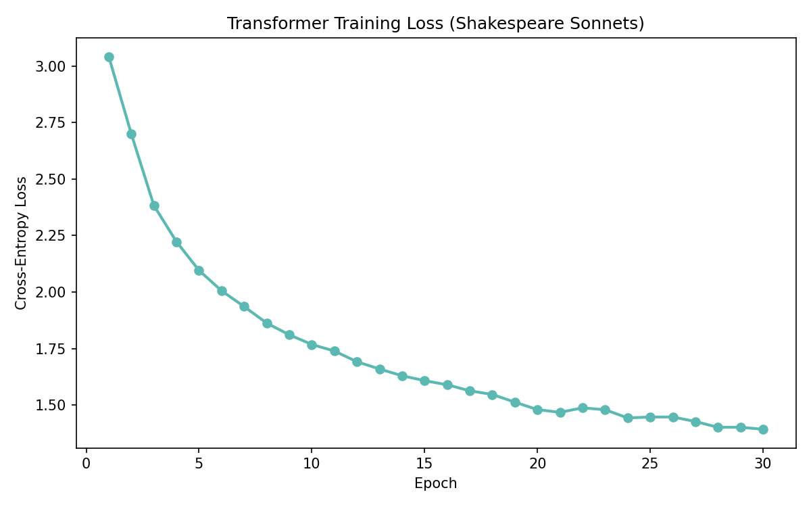
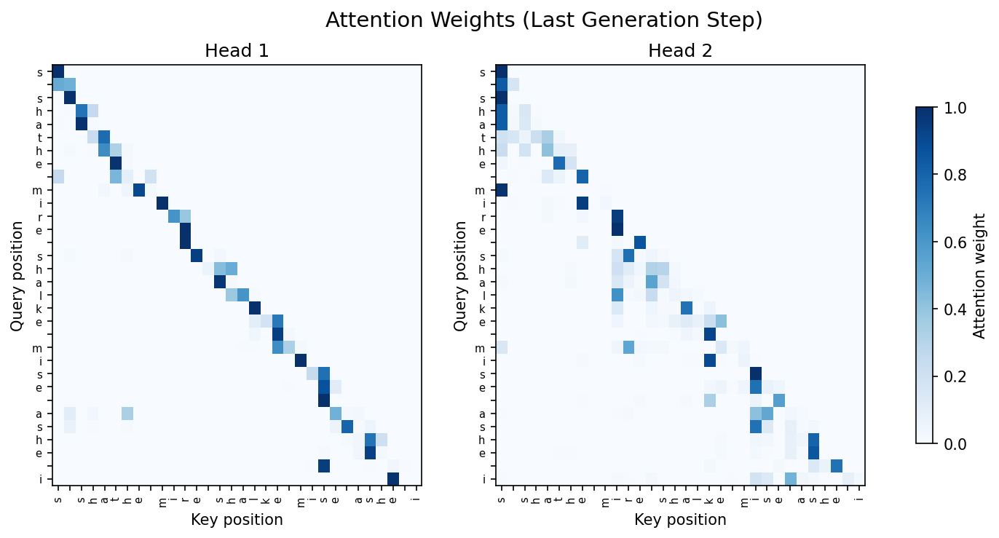

# Lesson 4: The Transformer (Vaswani et al., 2017)

In Lesson 3 the CNN learned to recognize digits by sliding a fixed 5x5 window across the image. Each position sees exactly 25 pixels — the filter's receptive field (the region of the input it can "see") is local and fixed. A vertical edge at pixel (5,5) and a curve at pixel (20,20) are processed the same way, but the filter can never look at both simultaneously. For images this is fine: nearby pixels matter most.

But what about sequences? Consider predicting the next word:

```
"The cat sat on the ___"
```

The answer ("mat", "floor", etc.) depends on "cat" and "sat" — words at variable distances. A 5x5 window sized for local context would miss these dependencies. You could stack many layers to grow the receptive field, but that's indirect: the signal has to pass through every intermediate layer in the network.

Before transformers, the dominant approach for sequences was the recurrent neural network (RNN). An RNN processes tokens one at a time, maintaining a hidden state that carries information forward. A token here means a single unit of input — in our case, one character. (In production systems, tokens are often subword pieces: "attention" might become "atten" + "tion". For this lesson, one character = one token.)

```
h_0 -> h_1 -> h_2 -> h_3 -> ... -> h_n
```

This is a sequential bottleneck: token 50 must wait for tokens 1-49 to be processed. Worse, gradients flowing backward through many time steps shrink exponentially — the same vanishing gradient problem from Lesson 2, but now across sequence positions instead of network layers. By the time the gradient reaches token 1, the signal from token 50 has nearly vanished. Long Short-Term Memory networks (LSTMs) and Gated Recurrent Units (GRUs) added gating mechanisms to help, but the fundamental sequential bottleneck remained.

What if, instead of processing tokens sequentially and hoping information survives the journey, each token could directly look at every other token and decide what's relevant?

The transformer's insight is self-attention. To explain what that means, we need one new concept: a position. In our previous networks, an input was a single vector: pixel values, logic gate inputs. In a transformer, the input is a sequence of vectors, one per token. Each vector in that sequence sits at a numbered position: position 0 is the first token, position 1 is the second, and so on. When we say "position 3 attends to position 1," we mean the token at index 3 is pulling information from the token at index 1.

Self-attention lets each position look at every other position and learn which ones matter, with the pattern changing based on the input. Instead of a fixed window or sequential processing, each position directly computes a relevance score against every other position. "Attending" simply means "deciding how much to focus on" — position 3 might attend strongly to position 1 (high score, pulls lots of information) and barely attend to position 2 (low score, mostly ignores it).

Here's how it works. Each token is represented as a vector (its embedding). Self-attention transforms each token's embedding by computing three vectors from it:

```
Query (Q): what this position is looking for in other positions
Key (K):   what this position offers to other positions
Value (V): the actual information this position carries
```

The names come from a database analogy: a query is matched against keys to find relevant entries, then the corresponding values are retrieved. Here the "lookup" is soft — instead of finding one exact match, every position gets a weighted blend of all values, with weights determined by how well each query matches each key.

For each position, its query vector is compared (via dot product) against the key vector of every other position. High dot product means "these two positions are relevant to each other." The scores are normalized with softmax (so they sum to 1), then used as weights to compute a weighted average of the value vectors. The result: each position's output is a blend of information from across the sequence, weighted by learned relevance.

Concretely, for tokens ["t", "h", "e", " "] with d_model=3 (d_model is the size of each token's vector — how many numbers represent each character):

### Step 1 — Embeddings (looked up from a table, 4x3):

```
t: [0.12, -0.34,  0.56]
h: [0.78,  0.23, -0.11]
e: [-0.45, 0.67,  0.33]
" ": [0.01, -0.89, 0.44]
```

### Step 2 — Project to Q, K, V via weight matrices:

```
Q = embeddings @ W_q    (each position gets a query vector)
K = embeddings @ W_k    (each position gets a key vector)
V = embeddings @ W_v    (each position gets a value vector)
```

### Step 3 — Attention scores (Q @ K^T / sqrt(d_k)):

```
score[i][j] = dot(Q[i], K[j]) / sqrt(3)
```

This gives a 4x4 matrix — every position scored against every other. Dividing by sqrt(d_k) prevents scores from growing too large, which would push softmax into near-zero gradient regions.

### Step 4 — Causal mask (so the model can't cheat by seeing the future):

When generating text, the model predicts one token at a time. It shouldn't see the answer before guessing. We enforce this by setting score[i][j] = -infinity for j > i, so each position can only attend to itself and earlier positions. After softmax, the masked entries become zero:

```
      t     h     e     _
t  [  .   -inf  -inf  -inf ]   t can only see t
h  [  .     .   -inf  -inf ]   h can see t, h
e  [  .     .     .   -inf ]   e can see t, h, e
_  [  .     .     .     .  ]   _ can see all
```

### Step 5 — Softmax (row-wise):

```
weights[i] = softmax(scores[i])
```

For position e (row 2), suppose after masking:

```
scores = [1.2, 0.8, 0.5]  (only first 3 visible)
weights = [0.45, 0.30, 0.25]  — "e" attends 45% to "t"
```

### Step 6 — Weighted sum of values:

```
output[i] = sum_j(weights[i][j] * V[j])
```

For position e: 0.45*V[t] + 0.30*V[h] + 0.25*V[e]

"Position 2 attended 45% to position 0 — it learned that the 't' is the most relevant context for predicting what follows 'the'."

That's the core mechanism. In our actual model, d_model=32 (not 3), so the vectors are larger but the process is identical.

Multi-head attention runs this entire Q/K/V process multiple times in parallel with different weight matrices. With 2 heads, each head works on d_k = d_model/2 = 16 dimensions. One head might learn to attend to nearby characters (local patterns like "th" followed by "e"), while another learns longer-range dependencies (matching quotes, repeating phrases). The head outputs are concatenated and projected back to d_model dimensions.

Positional encoding: since attention compares every position to every other position regardless of order (it's a set operation), the model has no way to know that position 0 comes before position 1. We fix this by adding sinusoidal position signals to the embeddings before they enter attention:

```
PE(pos, 2i)   = sin(pos / 10000^(2i/d_model))
PE(pos, 2i+1) = cos(pos / 10000^(2i/d_model))
```

Each position gets a unique pattern. The sinusoidal form lets the model learn to attend to relative positions: PE(pos+k) can be expressed as a linear function of PE(pos).

This lesson has more moving parts than the previous three. The core idea is attention — everything else (positional encoding, layer norm, residuals) is supporting infrastructure that makes it trainable. Here's how it all fits together:

The full architecture:

```
Input         Embed +     ┌─── Transformer Block ───────────┐     Output
(tokens)      Pos Enc     │                                 │
                          │  LayerNorm → Attention → + Res  │
"t" ─┐      ┌───────┐     │  LayerNorm → FF(dense) → + Res  │     ┌─────┐
"h" ─┤─────>│ embed │───> │                                 │ ──> │Dense│──> softmax
"e" ─┤      │  + PE │     │  (attention lets each position  │     │ 32  │    probs
" " ─┘      └───────┘     │   look at all prior positions)  │     │->48 │
                          └─────────────────────────────────┘     └─────┘

seq_len=32    d_model=32    2 attn heads     FF: 32->64->32         vocab=48
```

Reading left to right:

**Input:** a sequence of 32 character tokens, each represented as an integer ID (e.g., 'a'=0, 'b'=1, ...).

**Embedding + positional encoding:** each token ID is looked up in a table to get a 32-dimensional vector, then a sinusoidal position signal is added so the model knows where each token sits.

**Transformer block:** the core of the architecture. Two sublayers: (1) multi-head self-attention — each position computes relevance scores against all prior positions and blends their information; (2) feed-forward — the same dense layers from Lesson 2, applied independently at each position. These use ReLU instead of tanh — a simpler activation that avoids the vanishing gradient problem (ReLU's derivative is 1 for positive inputs, vs tanh's derivative that shrinks toward 0). Each sublayer has a residual connection (adding the input back, so the layer only needs to learn the change) and layer normalization (scaling to zero mean and unit variance to stabilize training).

**Output:** a dense layer projects from d_model=32 to vocab_size=48 (one score per character), then softmax converts to probabilities.

We use pre-norm (normalize before each sublayer), which is easier to train than the original paper's post-norm. Our layer norm omits learnable scale/shift parameters — the following dense layers absorb any needed rescaling.

Simplifications vs the original "Attention Is All You Need":

- 1 block instead of 6 (keeps training fast in pure Python)
- Pre-norm instead of post-norm (modern practice)
- No learnable layer norm params (gamma/beta omitted)
- SGD instead of Adam (matches prior lessons)
- Decoder-only (GPT-style) instead of encoder-decoder
- Character-level instead of subword tokenization

Let's see it learn Shakespeare, one character at a time.

## Part 1: The Data

```
Corpus: 4 Shakespeare sonnets (18, 29, 73, 130)
Characters: 2497
Vocabulary: 48 unique characters

First 200 characters:
"Shall I compare thee to a summer's day?\nThou art more lovely and more temperate.\nRough winds do shake the darling buds of May,\nAnd summer's lease hath all too short a date.\nSometime too hot the eye of"

Character vocabulary:
 '\n' ' ' "'" , - . ; ? A B C D F H I L M N R S T U W Y a b c d e f g h i j k l m n o p r s t u v w x y

Sequence length: 32 characters
Training sequences: 2465 (sliding window, stride 1)

Example input:  "Shall I compare thee to a summer"
Example target: "hall I compare thee to a summer'"
(target is input shifted right by one character)
```

## Part 2: The Architecture

```
Model architecture (decoder-only transformer):
  Token embedding (48x32)          1536 params
  Attention (Q,K,V,O: 32x32)      4096 params
    2 heads, d_k=16
  Feed-forward (32->64->32)          4192 params
  Output projection (32->48)         1584 params
  Total:                           11408 params

Compare: LeNet-5 had ~3,700 params for 10-class images.
This transformer has 11,408 params for 48-class
character prediction — a similar scale.
```

## Part 3: Training

```
Training: lr=0.01, epochs=30
Sequences: 206 (subsampled from 2465)
Each sequence: 32 characters predicting next character

Training (this takes a few minutes in pure Python)...

Training: epoch 30/30  loss=1.3932  [██████████████████████████████] 100%

Training results:
  Epoch   1: loss=3.0421
  Epoch   7: loss=1.9360
  Epoch  13: loss=1.6598
  Epoch  19: loss=1.5132
  Epoch  25: loss=1.4474
  Epoch  30: loss=1.3932

Sample predictions (input -> predicted next char):
  "...are thee to a summer" -> ' '  (expected "'")
  "...
When, in disgrace w" -> 'i'  (correct)
  "...ings.

That time of " -> 'i'  (expected 'y')
```

## Part 4: Generation

```
Prompt: "Shall I compare"
Generating 100 characters...

Generated text:
┌────────────────────────────────────────────────────────┐
│ Shall I compareeeee s dothin thou ghalkinds aan shea,  │
│ wit wit byes aaas I sheave mis shathe mire shalke mise │
│  ashe i                                                │
└────────────────────────────────────────────────────────┘
```

The output won't be coherent Shakespeare — this is a tiny model trained on ~1.8KB of text. But you should see it learning character-level patterns: common letter sequences, spacing, punctuation, and fragments of words from the sonnets.

## What Changed

The CNN looked through a fixed 5x5 window — a local, static receptive field. The transformer learns which positions to attend to, with the pattern changing based on input. This is the key shift: from fixed spatial structure to dynamic, data-dependent context.

What attention gives us:

**Global receptive field:** every position can attend to every other position in a single layer. The CNN needed stacked layers to grow its receptive field.

**Interpretability:** attention weights show what the model focuses on. In the heatmap above, brighter cells show stronger attention. You can see which characters the model considered when predicting the next one. CNNs and MLPs don't have such transparent internal states.

**Parallelism:** unlike RNNs, attention processes all positions simultaneously. No sequential bottleneck. This is why transformers train efficiently on GPUs — and why they scaled to billions of parameters while RNNs did not.

The cost: attention computes a score for every pair of positions, giving O(n^2) complexity in sequence length. For our 32-character sequences, that's a 32x32 = 1,024-entry attention matrix. For GPT-4's ~128,000-token context, that would be ~16 billion entries per layer per head. The same quadratic cost that makes attention powerful also makes it expensive — this is why techniques like sliding window attention, sparse attention, and linear attention are active research areas.

Backpropagation still works — same chain rule from Lesson 2. The forward pass has more steps than LeNet, but each step uses primitives you've seen: dense layers, softmax, addition. The backward pass is where the complexity shows up — gradients flowing through residual connections split into two paths (one through the sublayer, one through the skip connection), and the softmax backward involves all outputs simultaneously rather than independently. If the backward code is hard to follow, focus on the forward pass and treat the backward as "the chain rule applied to each step, working right to left." The softmax + cross-entropy gradient simplification (probs - target) that we used in Lesson 3 works here too.

The original paper used this architecture for machine translation (encoder-decoder). Modern LLMs (GPT, Claude) use decoder-only variants like the one here, scaled up enormously: billions of parameters, terabytes of text, thousands of GPUs.

Our 11,408-parameter model on 4 sonnets is the same algorithm. The difference is scale.

Next: we've now built a perceptron, an MLP, a CNN, and a transformer — each one introduced a new architectural idea. In Lesson 5 we'll step back and look at the training process itself: how modern optimizers, regularization, and scaling techniques turn these building blocks into systems that actually work at scale.

## Plots

### Training Loss Curve

Loss drops from ~3.0 (near random over 48 characters: -ln(1/48) = 3.87) to ~1.4 over 30 epochs. The steep initial descent shows the model quickly learning character frequencies and common bigrams. The flattening curve suggests the model has captured most of the learnable patterns in 4 sonnets — more data or a larger model would be needed to push further.



### Attention Weights

A heatmap of the attention pattern from the last generation step. Each row shows where that position is looking — brighter cells mean stronger attention. The causal mask is visible as the blank upper triangle (no position can attend to future tokens). Look for patterns: positions often attend strongly to themselves and to nearby characters, but also show longer-range attention to structurally important tokens like spaces and line breaks.


