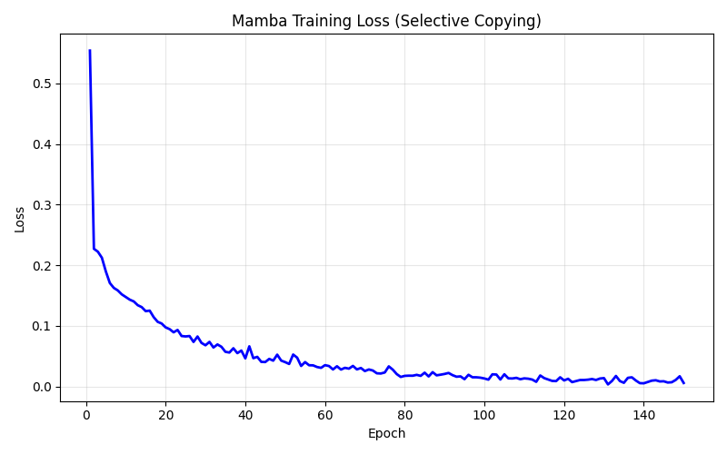
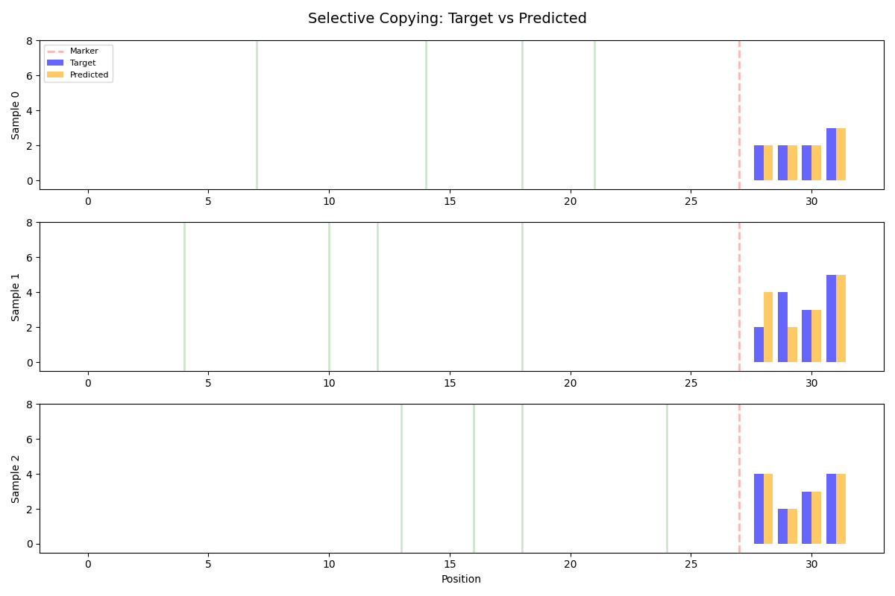
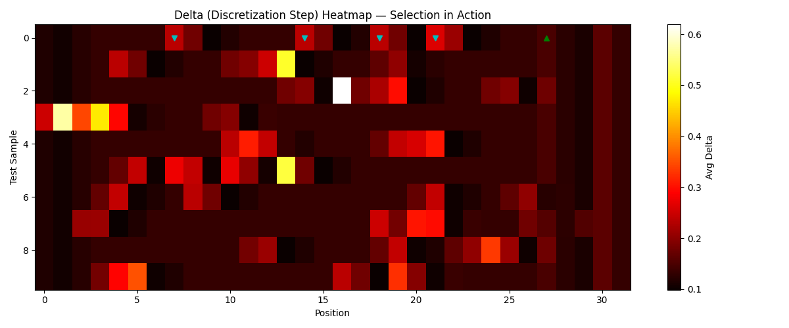

# Lesson 5: Mamba — Selective State Space Models (Gu & Dao, 2023)

The transformer (Lesson 4) looks at every position to process each token — that's what self-attention does. It works brilliantly, but the cost grows as O(L²) with sequence length. Double the sequence, quadruple the work.

What if a model could process sequences in O(L) — linear time — while still deciding what to remember? That's Mamba's core idea.

Instead of attention, Mamba maintains a hidden state that gets updated at each position. The key innovation: the update rule is input-dependent. The parameters B, C, and the discretization step Delta are all functions of the current input, so the model can:

- Spike Delta high at important tokens — write them into state
- Keep Delta low at irrelevant tokens — let them pass through
- Adjust B and C to control what gets stored and what gets read

This "selection mechanism" is what separates Mamba from classical state space models (which use fixed B, C and can only learn fixed patterns like convolutions).

## Part 1: The Data

**Task: Selective Copying** (from the Mamba paper, Figure 2)

The model sees a sequence with data tokens scattered at random positions among blanks. After a COPY_MARKER, it must reproduce the data tokens in order. The catch: the positions are random, so the model can't memorize a fixed pattern — it must inspect each token to decide whether to remember it.

```
Vocabulary: {0: BLANK, 1: COPY_MARKER, 2..7: data tokens}

Example:
  Input:  [6, 0, 0, 0, 0, 6, 7, 0, 0, 0, 0, 0, 0, 0, 0, 0, 0, 2, 0, 0, 0, 0, 0, 0, 0, 0, 0, 1, 0, 0, 0, 0]
  Target: [0, 0, 0, 0, 0, 0, 0, 0, 0, 0, 0, 0, 0, 0, 0, 0, 0, 0, 0, 0, 0, 0, 0, 0, 0, 0, 0, 0, 6, 6, 7, 2]
```

The data tokens appear at random positions. After the marker (1), the target contains those same tokens in their original order.

This is the Mamba paper's motivating task. A standard (non-selective) state space model with fixed B, C can solve regular copying (fixed spacing) by learning a convolution kernel that matches the offsets. But randomized spacing breaks this — the model MUST look at each token's content to decide whether to store it. That's exactly what Mamba's selection mechanism provides.

```
Training samples: 300
Test samples:     50
Sequence length:  32
Tokens to copy:   4
```

## Part 2: The Architecture

Single Mamba block following Figure 3 of the paper, sized for ~6K params:

```
d_model=24, d_inner=48 (expansion E=2),
d_state=8 (N), d_conv=4, dt_rank=6

+----- Mamba Block ----------------------------------+
|                                                     |
|  Input projection: embedded -> [x_branch, z_branch] |
|    W_in: (96, 24)                    2304 params    |
|                                                     |
|  x_branch path:                                     |
|    Conv1d (depthwise, causal, k=4)    240 params    |
|    SiLU                                             |
|    +-- Selective SSM --------------------------+    |
|    |  B = B_proj @ x        (d_state,)        |    |
|    |  C = C_proj @ x        (d_state,)        |    |
|    |  Delta = softplus(up(down(x)) + bias)    |    |
|    |  A_bar = exp(Delta * A)   discretize     |    |
|    |  B_bar = Delta * B        Euler approx   |    |
|    |  h[t] = A_bar*h[t-1] + B_bar*x[t]       |    |
|    |  y[t] = C.h[t] + D*x[t]                 |    |
|    +------------------------------------------+    |
|    SSM params (A,B,C,Delta,D):       1824 params    |
|                                                     |
|  z_branch: SiLU(z_branch) -> gate                   |
|  gated = ssm_out * gate                             |
|                                                     |
|  Output projection: gated -> projected  1176 params  |
+-----------------------------------------------------+

Embedding: (8, 24)                           192 params
LM head: (8, 24) + bias                     200 params
Total:                                      5936 params
```

Compare with the transformer (Lesson 4): the transformer pays O(L²) per layer (attention over all pairs), while Mamba processes the sequence in O(L) (single pass through the recurrence). Both models are roughly the same parameter count, but Mamba's computational cost scales linearly with sequence length.

The selective SSM is the key: at each position t, the model computes fresh B, C, and Delta from the input. Delta controls the "gate" — how much of the current input to write into the hidden state. When Delta is large, the discretized B_bar is large and the input gets written strongly. When Delta is small, the state mostly carries forward unchanged.

## Part 3: Training

```
Training: AdamW, lr=0.001, epochs=150
Weight decay: 0.01, gradient clipping: max_norm=1.0
Loss: cross-entropy over all positions (including blanks)
```

The model must learn to output BLANK at non-output positions and the correct data tokens after the marker. Cross-entropy over all positions means getting blanks right matters too — the model can't just focus on the copy slots.

AdamW (Lesson 6) adapts per-parameter learning rates, which helps because Mamba has diverse parameter types: the A_log values control state decay timescales, Delta biases control gating sensitivity, and the projections are standard linear layers.

### Training results

```
Epoch   1: loss=0.5540
Epoch  25: loss=0.0824
Epoch  50: loss=0.0400
Epoch  75: loss=0.0230
Epoch 100: loss=0.0131
Epoch 125: loss=0.0105
Epoch 150: loss=0.0056
```

The training curve is strikingly clean — a smooth, monotonic descent from 0.55 to 0.006 with no instability or loss spikes. Compare this with the CTM's non-monotonic descent and mid-training spike (Lesson 6). The difference reflects the architectures: Mamba's recurrence is a simple linear update `h[t] = A_bar*h[t-1] + B_bar*x[t]` where the gradients flow through element-wise products, making the backward pass stable. The CTM's 20-tick loop with attention, NLMs, and synchronization creates much more complex gradient dynamics.

The rapid initial descent (0.55 → 0.08 in 25 epochs) suggests the model quickly learns to predict BLANK at most positions — that's the easy part of the loss. The slower convergence from 0.08 → 0.006 is the model refining its selective copying: learning exactly when to spike Delta, what to write into state, and how to read it back out in the correct order.



## Part 4: Evaluation

```
Test results:
  Sequence accuracy (all 4 tokens correct): 32/50 (64.0%)
  Token accuracy (individual copy slots):   178/200 (89.0%)
```

89% token accuracy from a 5,936-parameter model trained from scratch in pure Python. The gap between token accuracy (89%) and sequence accuracy (64%) tells us something: most errors are single-token mistakes within otherwise correct sequences. Get one token wrong out of four and the whole sequence is marked wrong.

### Sample predictions

```
[OK]   data=[2, 2, 2, 3] -> target=[2, 2, 2, 3], predicted=[2, 2, 2, 3]
[MISS] data=[2, 4, 3, 5] -> target=[2, 4, 3, 5], predicted=[4, 2, 3, 5]
[OK]   data=[4, 2, 3, 4] -> target=[4, 2, 3, 4], predicted=[4, 2, 3, 4]
[MISS] data=[6, 7, 5, 4] -> target=[6, 7, 5, 4], predicted=[7, 6, 5, 4]
[OK]   data=[2, 2, 6, 3] -> target=[2, 2, 6, 3], predicted=[2, 2, 6, 3]
```

The misses are revealing — both are token-order swaps in the first two positions: [2,4] predicted as [4,2], [6,7] predicted as [7,6]. The model captures the right tokens but occasionally gets their order wrong. This makes sense: the 8-dimensional hidden state must encode both token identity and temporal ordering for 4 tokens. When two data tokens have similar spacing relative to the copy marker, the state's position encoding can blur.



## Part 5: Selection in Action

The selection mechanism works through Delta — the discretization step size. When Delta is large at a position, the model writes that input strongly into state. When Delta is small, the state carries forward mostly unchanged.

If Mamba learns the task correctly, Delta should spike at data token positions and stay low at blanks. The delta heatmap confirms this directly:



The heatmap shows Delta values across sequence positions for three test samples. Data token positions (marked with cyan triangles) consistently show elevated Delta values, while blank positions stay low. The copy marker (green triangle) gets a moderate Delta — the model notes its presence but doesn't need to write it into the state used for output.

### Delta values (selected samples)

```
Sample 0:
  Input:  [0, 0, 0, 0, 0, 0, 0, 2, 0, 0, 0, 0, 0, 0, 2, 0, 0, 0, 2, 0, 0, 3, 0, 0, 0, 0, 0, 1, 0, 0, 0, 0]
  Tokens:     .    .    .    .    .    .    .  [2]    .    .    .    .    .    .  [2]    .    .    .  [2]    .    .  [3]    .    .    .    .    .  [M]    .    .    .    .
  Delta:   0.12 0.11 0.12 0.13 0.13 0.13 0.13 0.24 0.18 0.10 0.12 0.13 0.13 0.13 0.24 0.18 0.10 0.12 0.24 0.18 0.10 0.26 0.21 0.10 0.12 0.13 0.13 0.15 0.12 0.11 0.16 0.13

Sample 1:
  Input:  [0, 0, 0, 0, 2, 0, 0, 0, 0, 0, 4, 0, 3, 0, 0, 0, 0, 0, 5, 0, 0, 0, 0, 0, 0, 0, 0, 1, 0, 0, 0, 0]
  Tokens:     .    .    .    .  [2]    .    .    .    .    .  [4]    .  [3]    .    .    .    .    .  [5]    .    .    .    .    .    .    .    .  [M]    .    .    .    .
  Delta:   0.12 0.11 0.12 0.13 0.24 0.18 0.10 0.12 0.13 0.13 0.18 0.20 0.25 0.51 0.10 0.12 0.13 0.13 0.17 0.20 0.11 0.12 0.13 0.13 0.13 0.13 0.13 0.15 0.12 0.11 0.16 0.13

Sample 2:
  Input:  [0, 0, 0, 0, 0, 0, 0, 0, 0, 0, 0, 0, 0, 4, 0, 0, 2, 0, 3, 0, 0, 0, 0, 0, 4, 0, 0, 1, 0, 0, 0, 0]
  Tokens:     .    .    .    .    .    .    .    .    .    .    .    .    .  [4]    .    .  [2]    .  [3]    .    .    .    .    .  [4]    .    .  [M]    .    .    .    .
  Delta:   0.12 0.11 0.12 0.13 0.13 0.13 0.13 0.13 0.13 0.13 0.13 0.13 0.13 0.18 0.20 0.10 0.62 0.18 0.22 0.30 0.10 0.12 0.13 0.13 0.18 0.20 0.10 0.18 0.12 0.11 0.16 0.13
```

The pattern is clear: blanks sit at Delta ~0.12-0.13, while data tokens spike to 0.18-0.62. Sample 2 is especially striking — the token at position 16 ([2]) hits Delta=0.62, nearly 5x the blank baseline. The model has learned to open its gate wide for data tokens and keep it nearly shut for blanks. This is the selection mechanism working exactly as designed.

## What Changed

The progression so far:

| Lesson | Model | Year | Key idea |
|--------|-------|------|----------|
| 1 | Perceptron | 1958 | One neuron, one decision boundary |
| 2 | MLP | 1986 | Hidden layers + backprop solve XOR |
| 3 | LeNet-5 | 1998 | Convolutions learn spatial features |
| 4 | Transformer | 2017 | Attention lets every position see every other — O(L²) |
| 5 | Mamba | 2023 | Selective state spaces — O(L) with input-dependent gating |
| 6 | CTM | 2025 | Internal time + neural synchronization |

What Mamba introduces:

**State space models:** instead of attention (compare all pairs), maintain a running hidden state h[t] that summarizes the sequence so far. Process positions one at a time in O(L).

**Selection mechanism:** classical SSMs use fixed B, C matrices — they're linear time-invariant (LTI) and can only learn patterns with fixed spacing (equivalent to convolutions). Mamba makes B, C, and Delta functions of the input, breaking LTI. The model can now decide PER TOKEN what to remember.

**Delta as a gate:** the discretization step Delta controls how much of the current input gets written into state. High Delta = "this is important, remember it." Low Delta = "this is noise, skip it." The delta heatmap above shows this directly.

**Linear scaling:** the recurrence `h[t] = A*h[t-1] + B*x[t]` is O(1) per position, so the full sequence costs O(L). For long sequences, this is a fundamental advantage over O(L²) attention.

The selective copying task demonstrates exactly WHY selection matters: random spacing means the model can't rely on fixed convolution patterns. It must inspect each token, decide if it's data or blank, and selectively write data tokens into its state for later recall.

Our 5,936-parameter model shows the mechanism working in miniature. The paper scales to billions of parameters and matches or exceeds transformers on language modeling, DNA modeling, and audio.
