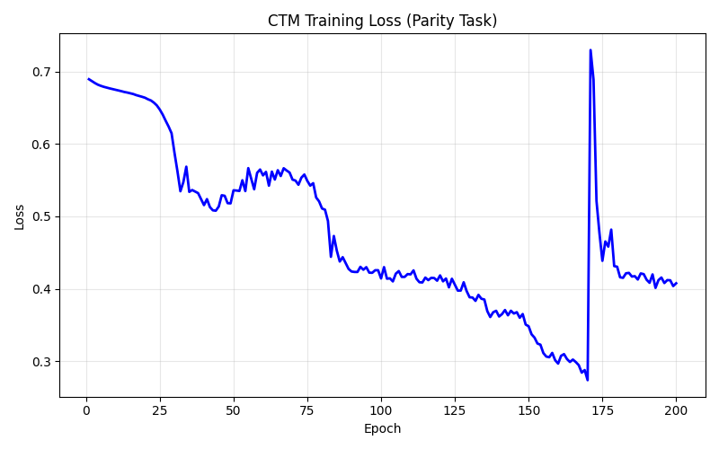
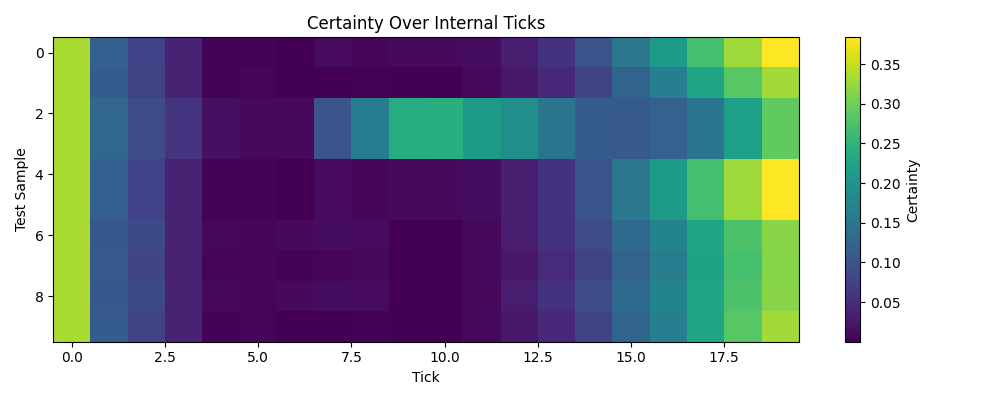

# Lesson 6: The Continuous Thought Machine (Darlow et al., 2025)

Every network we've built so far has the same limitation: given an input, it runs one forward pass and produces one answer. A simple input and a hard input get exactly the same amount of computation. But humans don't work this way — we think longer about harder problems. What if a network could do the same?

The Continuous Thought Machine gives the network an internal time dimension. Instead of one forward pass, it runs T "thought steps." At each tick, it:

1. Produces pre-activations through a synapse model (an MLP)
2. Processes each neuron's activation history through private per-neuron MLPs (neuron-level models, or NLMs)
3. Measures temporal correlations between neurons' activities (neural synchronization)
4. Uses synchronization to make predictions AND to decide what in the input to attend to next

The key innovations:

**Neuron-level models:** each neuron has its own private weights that process a rolling history of its past activations. This gives every neuron its own temporal dynamics — like giving each neuron a small memory and a small brain to process that memory.

**Neural synchronization:** instead of using neuron activations directly, the CTM measures how pairs of neurons' activities correlate over time. These correlations — computed as a recursive weighted dot product — become the representation the network uses for everything: prediction, attention queries, decision-making.

**Certainty-based loss:** the network predicts at every tick, but the loss only uses two ticks — the one with lowest loss and the one with highest certainty. This naturally gives adaptive compute: the network learns to become certain sooner on easy inputs and to keep thinking on hard ones.

## Part 1: The Data

**Task: Parity** — predict the cumulative parity of ±1 sequences.

Why parity? It's a task where the answer depends on the entire input — every ±1 value affects the running product. A feedforward network sees the whole sequence at once but has no way to iteratively track the running sign. The CTM's tick loop gives it exactly that: each thinking step can refine its running estimate. Difficulty also scales naturally with sequence length, exercising the adaptive compute mechanism. Darlow et al. use parity as a benchmark for these reasons.

Each input is a sequence of +1 or -1 values. The target at each position is 1 if the running product is positive, 0 otherwise.

```
Example:
  Input:   [-1.0, 1.0, 1.0, 1.0, -1.0, -1.0, -1.0, 1.0]
  Target:  [0.0, 0.0, 0.0, 0.0, 1.0, 0.0, 1.0, 1.0]
  (product flips sign with each -1)

Training samples: 200
Test samples:     20
Sequence length:  16
Output classes:   2 (parity 0 or 1 at the last position)
```

## Part 2: The Architecture

The CTM's parameter budget is comparable to the transformer from Lesson 4 (5,794 vs 11,408), but it spends those parameters very differently. Most of the capacity is in the 32 independent NLMs — private per-neuron networks that give each neuron its own temporal dynamics.

```
┌─────── Internal Tick Loop (T=20 ticks) ────────────────┐
│                                                        │
│  Synapse: concat(z,o) → SiLU → a^t                     │
│    MLP: (32+16) → 32 → 32                  2624 params │
│                                                        │
│  NLMs: per-neuron history → z^{t+1}                    │
│    32 neurons × (M=7 → 4 → 1)              1184 params │
│                                                        │
│  Sync: recursive α,β → S vectors                       │
│    J_out=8, J_action=8 (semi-dense)        128 params  │
│                                                        │
│  Output: S_out → logits → softmax          130 params  │
│  Attention: S_action → query, cross-attn   1536 params │
└────────────────────────────────────────────────────────┘

M: memory window, each NLM sees its last 7 pre-activations
J_out, J_action: neurons per sync group (8×8=64 pairs each)

Embeddings & projections:                      160 params
Initial state (z_init):                         32 params
Total:                                        5794 params
```

The tick loop simplified — this runs 20 times per input:

```
for each tick t = 1..T:
  a^t     = Synapse(z^t, o^t)       ← pre-activations
  z^{t+1} = NLM_d(history of a)     ← per-neuron MLPs
  S^t     = Sync(z^{t+1})           ← temporal correlations
  y^t     = W_out · S^t_out         ← predict each tick
  q^t     = W_query · S^t_action    ← attention query
  o^t     = CrossAttention(q^t, KV) ← re-read input
```

Key insight: the output y^t is produced at EVERY tick, but the loss only selects two ticks — the best-loss tick (t1) and the most-certain tick (t2). The model learns when to "commit."

## Part 3: Training

```
Training: lr=0.00005, epochs=200
Samples: 200 sequences of length 16
Internal ticks: 20 per sample
Loss: certainty-based (min-loss tick + max-certainty tick)
```

The learning rate is tiny because gradients flow through 20 ticks of the inner loop — similar to a 20-layer-deep network. This is backpropagation through time (BPTT): the tick chain is structurally identical to an unrolled RNN, and the backward pass must reverse through every tick, accumulating gradients along the way. Without a very small step size the accumulated gradients blow up and training diverges.

**Optimizer: AdamW** (adaptive learning rates per parameter)

Lessons 1–4 used SGD — one learning rate for everything. That works when all parameters play similar roles. But the CTM has fundamentally different parameter types: decay rates (scalars controlling temporal memory), NLM weights (32 private neural nets), synapse weights (shared MLP), and attention projections. SGD can't balance all of these — it plateaus at loss ~0.6 because the learning rate that works for one group is wrong for another.

AdamW solves this by tracking each parameter's gradient history and adapting the step size automatically. Parameters with large gradients get smaller steps; parameters with small gradients get larger steps.

Gradient clipping is disabled (max_norm=999). The CTM's tick loop creates recurrent gradient flow that can explode, but AdamW's per-parameter scaling handles this naturally.

### Training results

```
Epoch   1: loss=0.6894
Epoch   5: loss=0.6803
Epoch  10: loss=0.6748
Epoch  15: loss=0.6700
Epoch  20: loss=0.6638
Epoch  25: loss=0.6475
Epoch  30: loss=0.5876
Epoch  35: loss=0.5338
Epoch  40: loss=0.5155
Epoch  45: loss=0.5136
Epoch  50: loss=0.5360
Epoch  55: loss=0.5666
Epoch  60: loss=0.5566
Epoch  65: loss=0.5637
Epoch  70: loss=0.5508
Epoch  75: loss=0.5491
Epoch  80: loss=0.5109
Epoch  85: loss=0.4527
Epoch  90: loss=0.4239
Epoch  95: loss=0.4299
Epoch 100: loss=0.4143
Epoch 105: loss=0.4209
Epoch 110: loss=0.4199
Epoch 115: loss=0.4155
Epoch 120: loss=0.4185
Epoch 125: loss=0.4058
Epoch 130: loss=0.3883
Epoch 135: loss=0.3852
Epoch 140: loss=0.3618
Epoch 145: loss=0.3659
Epoch 150: loss=0.3483
Epoch 155: loss=0.3112
Epoch 160: loss=0.2967
Epoch 165: loss=0.3023
Epoch 170: loss=0.2739
Epoch 175: loss=0.4387
Epoch 180: loss=0.4305
Epoch 185: loss=0.4169
Epoch 190: loss=0.4125
Epoch 195: loss=0.4156
Epoch 200: loss=0.4076
```

The training curve shows the characteristic non-monotonic descent of a CTM learning parity. Loss drops in stages — first breaking out of the initial plateau (~0.69 to ~0.55 around epoch 30), then a longer descent through the 0.4s, reaching a minimum of ~0.27 around epoch 170 before a sharp spike and partial recovery. This spike is typical of recurrent training: the model occasionally hits an unstable gradient configuration, jumps out of its basin, and has to find its way back.



## Part 4: Evaluation

```
Test accuracy: 18/20 (90.0%)
```

Training for 300 epochs pushes accuracy to ~95%. The extra 100 epochs let AdamW settle into a lower basin — loss drops from ~0.35 to ~0.28.

### Sample predictions

```
seq 0: target=0, t1=19, t2=19, certainty@best=0.384
seq 1: target=1, t1=0,  t2=0,  certainty@best=0.335
seq 2: target=1, t1=0,  t2=0,  certainty@best=0.335
seq 3: target=1, t1=0,  t2=0,  certainty@best=0.335
seq 4: target=0, t1=19, t2=19, certainty@best=0.384
```

Notice how t1 (best-loss tick) and t2 (most-certain tick) agree — the model's most accurate tick is also its most confident. For some samples the best tick is t=0 (the model "knows" early), for others it's t=19 (needs all 20 thinking steps). This is adaptive compute emerging from the certainty-based loss, without any explicit halting mechanism.

The certainty values are low in absolute terms — 0.384 at best for a model getting 90% accuracy. The model doesn't need to be "confident" in an absolute sense; it just needs its most-certain tick to be more certain than the others. Certainty here is relative, not a calibrated probability. Don't expect softmax-style 0.95+ confidence — the loss optimizes for the right tick to be the best tick, not for that tick to be near-certain.

## Part 5: Adaptive Compute

The certainty heatmap shows how the model's confidence evolves across the 20 internal ticks for each test sample. Brighter colors mean higher certainty.



Several patterns are visible:

- **Tick 0 is often bright** — the initial state z_init gives a non-trivial starting prediction before any thinking has happened. This is learned: the model discovers that z_init can encode a useful prior.
- **The middle ticks are dark** — certainty drops as the model processes the input and its internal state becomes less committed. The network is "thinking" — exploring the input through attention, updating its running estimates.
- **Certainty recovers in later ticks** — as the model converges on an answer, the later ticks become more confident. The rightward brightening shows the model building certainty through iterative refinement.
- **Different samples have different profiles** — sample 3 (row 3) develops certainty earlier than sample 8 (row 8), showing the model adapting its compute to input difficulty.

### Certainty values (selected samples)

```
seq 0: [0.34  0.12  0.08  0.04  0.00  0.00  0.00  0.01  0.01  0.01
        0.01  0.01  0.03  0.06  0.10  0.15  0.21  0.27  0.33  0.38]
seq 1: [0.34  0.11  0.08  0.04  0.00  0.00  0.00  0.00  0.00  0.00
        0.00  0.01  0.02  0.04  0.08  0.12  0.17  0.23  0.28  0.33]
seq 2: [0.34  0.13  0.09  0.06  0.02  0.01  0.01  0.10  0.16  0.24
        0.24  0.21  0.19  0.15  0.11  0.11  0.12  0.15  0.22  0.29]
```

Seq 2 is interesting — certainty peaks mid-sequence (ticks 7–10) then drops before recovering. The model initially converges on an answer, becomes less sure as it processes more of the input, then rebuilds confidence. This non-monotonic certainty profile is exactly what you'd expect for a parity task where each new value can flip the running product.

## What Changed

The transformer (Lesson 4) processes a sequence in one pass: each position attends to other positions, but the network's depth is fixed. The CTM adds a second kind of depth — internal time. The network iterates T times, and each iteration can change what it attends to and refine its answer.

**Internal time:** the network "thinks" for T steps, each building on the previous. The synapse-NLM-sync loop is the core mechanism.

**Neuron-level models:** instead of uniform activations, each of the 32 neurons has its own private MLP processing its own activation history. This means neurons can develop specialized temporal behaviors.

**Neural synchronization:** the representation isn't neuron activations but their temporal correlations. Two neurons that fire in sync carry different information than two that alternate. This is computed recursively via weighted dot products with learnable decay rates.

**Adaptive compute:** because the loss selects the best tick (not the last one), the model naturally learns to commit early on easy inputs and keep thinking on hard ones. No explicit halting mechanism needed — it emerges from the certainty-based loss.

The CTM composes everything from prior lessons:

- The synapse model is an MLP (Lesson 2)
- The 32 NLMs are each their own tiny MLP (Lesson 2 again — backprop is doing triple duty: synapse, NLMs, and output projection)
- Cross-attention reads the input (Lesson 4)
- The tick loop is the new idea

Our 5,794-parameter model on parity is a minimal version of the architecture. The paper uses 1024-dimensional models on tasks ranging from image classification to maze navigation. The difference is scale — and the same backpropagation through time (BPTT) we use here scales to those larger settings.
